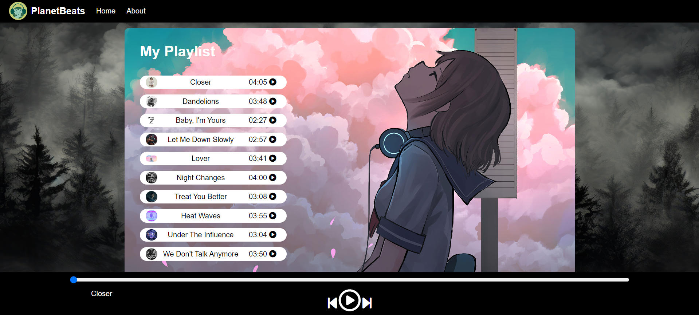

# Spotify Clone

A Spotify clone project built with HTML, CSS, and JavaScript.

## Demo

Check out the live demo: [Spotify-Clone](https://namdevkashish.github.io/Spotify-Clone/)

## Screenshot

*Sample Layout*

## Description

This project aims to recreate the basic functionality and design of Spotify, allowing users to play music. It utilizes HTML, CSS, and JavaScript to build the user interface and handle the interactions.

## Features

- Music player: Users can play and control the playback of selected songs.
